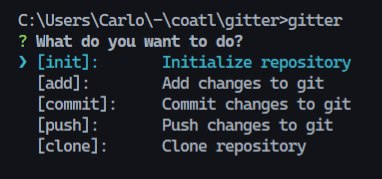

# Gitter



Gitter is a CLI tool for modeling conventional commit messages, formatting and other operations related to git.

## Installation

```bash
npm install -g @coatl/gitter

# or using yarn
yarn global add @coatl/gitter

# or using pnpm
pnpm add -g @coatl/gitter
```
